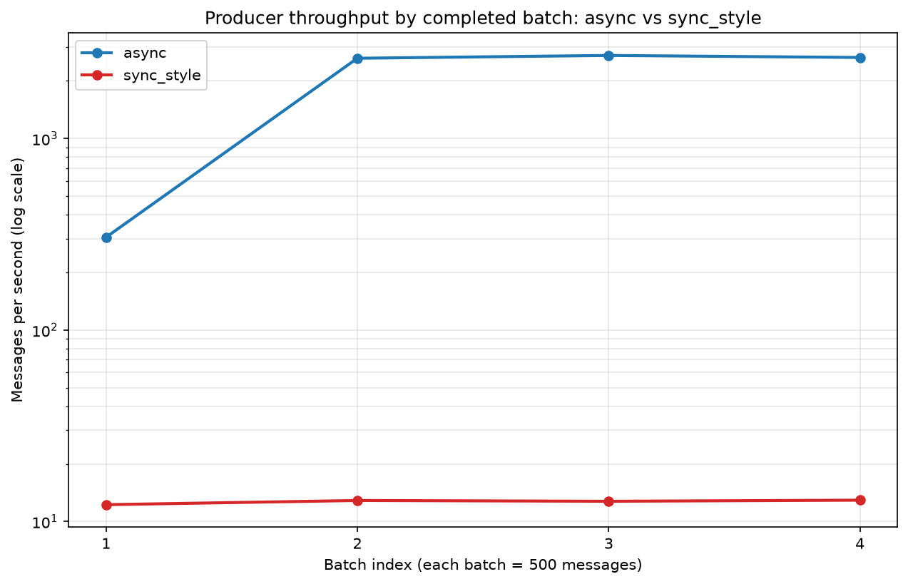

# Assignment 1 Report

## Student and run information

- Name: Mark Goold
- USF username: mgoold2
- Run ID: assignment1
- Topic: `msds682.demo01.trip-events.v1`
- Seed: 682
- Messages per strategy: 2,000
- Batch size: 500

## AI assistance disclosure

- I used AI assistance for this assignment: **Yes**
- If Yes, I included a completed `AI_USAGE.md`: **Yes**

## Demo 02A: sync-style producer

Evidence: [`evidence/demo02a_report.json`](evidence/demo02a_report.json)

The sync-style run attempted 4 messages and delivered 4, with 0 failed and 0
remaining after flush, in 1.580373 seconds. All four messages carried the key
`trip_981` and landed on partition 2 at consecutive offsets 20–23, which shows
that keying by `trip_id` keeps one trip's lifecycle ordered on a single
partition.

Flushing after every message is easy to understand because the program becomes
strictly sequential: produce one message, block until its delivery callback has
fired, then move to the next. There is never more than one message in flight, so
the code reads like ordinary synchronous I/O and any failure is immediately
attributable to the message just sent. It is normally slow for exactly the same
reason. `flush()` blocks until the producer's queue is empty, so every message
pays a full network round trip to Confluent Cloud before the next one is even
queued. At roughly 0.4 seconds per message in this small run, the client spends
almost all of its time waiting on the network instead of batching messages
together, and none of librdkafka's internal batching or pipelining can help.

## Demo 02B: asynchronous producer

Evidence: [`evidence/demo02b_report.json`](evidence/demo02b_report.json)

The asynchronous run attempted 4 messages and delivered 4, with 0 failed and 0
remaining after flush, in 1.072878 seconds — faster than the sync-style run of
the same 4 messages (1.580373 s) even at this very small size.

`produce()` is asynchronous: it enqueues the message in an in-memory buffer and
returns almost immediately, so the loop can keep queueing without waiting for
the broker. `poll(0)` is called once per iteration inside the loop. The `0`
timeout means "do not block": it simply serves any delivery callbacks that have
already completed, which keeps the callback queue drained and stops the internal
buffer from growing without bound during a long run. Because `poll(0)` never
waits, messages that are still in flight when the loop ends have not yet been
confirmed. That is why one final `flush()` is called exactly once after the
loop: it blocks until every outstanding message has been delivered or has
failed, and its return value (the number of messages still undelivered) is
recorded as `remaining_after_flush`, which was 0 here.

## Demo 02C: performance benchmark

Plot: [`results/producer_benchmark.png`](results/producer_benchmark.png)
Data: [`results/producer_benchmark.csv`](results/producer_benchmark.csv)
Config: [`evidence/demo02c_config.json`](evidence/demo02c_config.json)



The asynchronous strategy was dramatically faster in my run. Across four
500-message batches, async settled at roughly 2,660 messages per second
(0.184–0.191 s per batch) while sync-style held steady at about 12.7 messages
per second (38.7–40.8 s per batch) — a difference of roughly 205×. Every one of
the eight rows recorded `batch_delivered = 500`, `batch_failed = 0`, and
`remaining_after_flush = 0`, so the comparison is between two complete,
successful deliveries of identical logical payloads generated from seed 682.

The performance differs because of where each strategy waits. Sync-style calls
`flush()` after every single message, so each message costs a full round trip to
Confluent Cloud; at roughly 78 ms per message, 500 messages take about 39
seconds no matter how fast the client is. Async calls `produce()` 500 times
first, letting librdkafka batch and pipeline many messages per request, serves
completed callbacks with non-blocking `poll(0)` calls along the way, and blocks
only once at the batch boundary. The network latency is paid concurrently rather
than 500 times in series. One detail visible in the plot supports this: async
batch 1 reached only 305 messages per second, roughly nine times slower than
batches 2–4, because the first batch absorbs TLS handshake, SASL authentication,
and topic metadata fetch. Sync-style shows no comparable warm-up spike (40.8 s
versus about 38.9 s) because that fixed startup cost is negligible beside 500
sequential round trips.

Each strategy has real trade-offs. Sync-style is simple to reason about and
gives immediate, per-message confirmation, which makes it useful for teaching,
for debugging a broken connection, or for a low-volume case where per-message
certainty matters more than speed. Its disadvantage is that throughput is capped
by network latency and it cannot use batching at all. Async achieves far higher
throughput and is the normal production pattern, but it is harder to reason
about: failures surface later and out of order in callbacks, messages sit in a
memory buffer that must be drained, and forgetting the final `flush()` silently
loses whatever was still in flight at exit.

Callback handling, `poll()`, and `flush()` are what connect delivery to timing.
The delivery callback is the only place the program learns an individual
message's fate, so all counting happens there. `poll(0)` serves those callbacks
without blocking, which is what allows async to keep producing while deliveries
complete in the background. `flush()` is the blocking wait, and its placement is
the entire difference between the two strategies: inside the loop it serializes
everything, and once per batch it lets the batch pipeline. My timer starts
before the first `produce()` of a batch and stops only after that batch's
`flush()` returns, so every reported number measures completed delivery rather
than time spent merely queueing.

This run should not be treated as a universal Kafka capacity claim. It is a
single client on one laptop and one network connection, talking to one
Confluent Cloud cluster in `us-east1` over a shared internet path, sending only
2,000 small JSON messages per strategy with default producer settings and no
tuning of `linger.ms`, `batch.size`, `acks`, or compression. Throughput here is
dominated by client-to-broker latency, not by broker capacity. Different
hardware, region, partition count, message size, acknowledgement setting, or
time of day would all move these numbers substantially, and the sync-style
figure in particular measures round-trip latency rather than anything about how
much Kafka itself can absorb.

## Demo 02D: validation and serialization

Evidence: [`evidence/demo02d_report.json`](evidence/demo02d_report.json)

The run attempted 4 messages and delivered 4, with 0 failed and 0 remaining
after flush, in 1.012346 seconds.

Sample serialized event:

```json
{"trip_id":"trip_981","event_type":"trip_requested","rider_id":"rider-981","event_time":"2026-07-04T10:00:00Z","zone":"north"}
```

The path from Python object to Kafka message has three distinct steps. First,
the event is constructed as a Pydantic `TripEvent` model, which validates it:
`event_type` must be one of four allowed literals and `fare` must be a
nonnegative number, so a malformed event is rejected before it can reach the
topic. Second, `model_dump_json(exclude_none=True)` converts the validated model
to a compact JSON string; `exclude_none=True` is why `driver_id` and `fare` do
not appear in the sample above, since a `trip_requested` event has neither.
Third, `.encode("utf-8")` turns that string into bytes. The key follows the same
idea in a simpler form: `trip_id.encode("utf-8")`.

Kafka ultimately stores keys and values as bytes because the broker is
deliberately payload-agnostic. It appends and serves opaque byte arrays and
never parses application data, which keeps it fast and lets entirely different
producers and consumers — in different languages, using JSON, Avro, Protobuf, or
anything else — share one log. The consequence is that the schema is a contract
between producer and consumer, enforced at the edges (here, by Pydantic on
write), not by Kafka itself.

## Producer-code understanding

1. **What configuration is required to create the producer, and why must it stay
   outside source code?**
   The producer needs `bootstrap.servers` (the cluster endpoint), plus
   `security.protocol` (`SASL_SSL`), `sasl.mechanisms` (`PLAIN`), and the
   `sasl.username` / `sasl.password` API key and secret. The username and
   password are live credentials that grant write access to the cluster, so
   hard-coding them would leak them into git history, shared screenshots, and
   any submitted archive. Loading them from an ignored `.env` file keeps the
   secret out of the repository and lets different people run the same code with
   their own credentials.

2. **What does the delivery callback record for a success and for a failure?**
   On failure the callback receives a non-null error and records the error text
   in `failed_messages`. On success it increments `delivered_count` and retains
   at most ten secret-free samples containing only routing metadata — topic,
   partition, offset, and the decoded key — which is enough to prove delivery
   without bloating the report or exposing anything sensitive.

3. **What is the difference between `poll(0)` and `flush()` in these programs?**
   `poll(0)` is non-blocking: it serves whatever delivery callbacks have already
   completed and returns immediately, so producing can continue. `flush()`
   blocks until the entire queue has drained and every callback has fired, and
   returns the number of messages still undelivered.

4. **Why is one final `flush()` required before the asynchronous script exits?**
   Because `produce()` only queues messages, some are still in flight when the
   loop ends, and `poll(0)` never waits for them. Without a final `flush()` the
   process would exit with messages unsent and undelivered, and the report would
   both undercount deliveries and silently hide failures.

## Limitations and cleanup

This run is not a universal Kafka capacity claim. It measures one client
process, on one machine, over one network path, against a single Confluent Cloud
cluster, using default producer tuning and 2,000 small JSON messages per
strategy. The sync-style number in particular is a measurement of network
round-trip latency, not of broker throughput, and every figure here would change
with different hardware, region, partition count, message size, `acks` setting,
batching configuration, or network conditions. The valid conclusion is the
*relative* one — that flushing per message serializes on latency while batched
asynchronous producing pipelines it — not the absolute messages-per-second
values.

Cleanup and credential safety:

- Credentials were loaded only from an ignored `.env` file and never appear in
  source code, the CSV, the JSON evidence, or this report. The evidence files
  record only `has_username` / `has_password` booleans and the bootstrap host.
- `.env` and `.venv/` are listed in `.gitignore` and were removed from the
  submission folder before creating the ZIP.
- `.env.example` is included with blank values.
- No additional cloud resources were created for this assignment beyond the
  Demo 01 topic, which is shared by all four producer parts; no extra topics or
  clusters were left running.

## Extra credit submitted

All three extra-credit items are included. Full details and evidence are in
[`extra_credit/EXTRA_CREDIT.md`](extra_credit/EXTRA_CREDIT.md); none of it
replaces the required Confluent work above.

| Item | Summary | Key evidence |
|---|---|---|
| **+1 Deterministic local replay** | Credential-free dry-run harness reusing the same event contract, proving seed 682 always regenerates a byte-identical stream (and that a different seed does not). 6 additional tests. | `extra_credit/local_replay.py`, `tests/test_local_replay.py`, `evidence/xc_local_replay_report.json` |
| **+1 AI-assisted engineering review** | One suggestion accepted and one rejected, each decided by measurement: the sample-cap boundary (9 / 11 / 10 retained) and serialization cost (0.24 % of a batch vs 3.43 % run-to-run noise). | [`extra_credit/AI_REVIEW.md`](extra_credit/AI_REVIEW.md), `evidence/xc_review_evidence.json` |
| **+1 Advanced evaluation and observability** | Three additional independent 2,000-messages-per-strategy runs (12,000 messages) with distinct run IDs and output files; p50/p95 batch latency, run-to-run variability, and a documented real connectivity failure. | `results/producer_benchmark_run{1,2,3}.csv`, `results/xc_latency_by_run.png`, `evidence/xc_variability_report.json` |

Headline extra-credit numbers across the three additional runs: async p50
0.195 s / p95 1.499 s at 2,026.06 msg/s mean; sync-style p50 39.98 s / p95
42.21 s at 12.44 msg/s mean; 6,000 delivered per strategy with zero failures and
zero remaining; pooled async advantage 162.9×.
